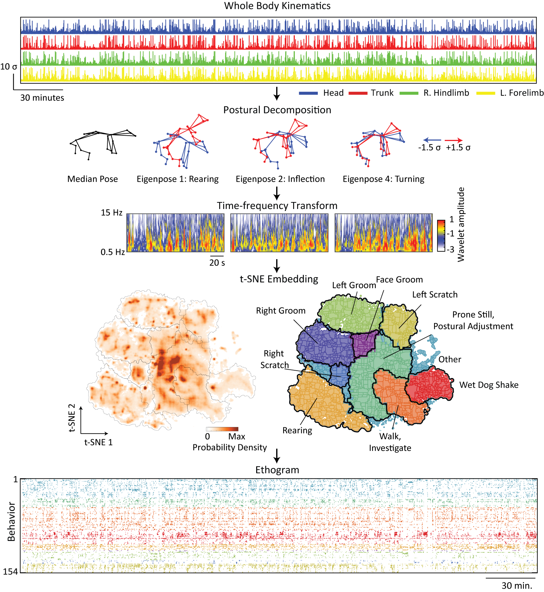
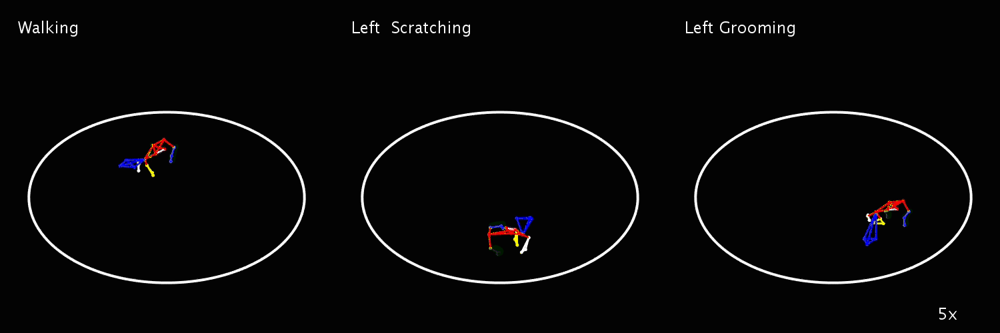
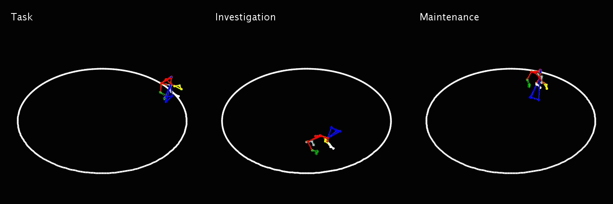

### CAPTURE: Continuous Appendicular and Postural Tracking Using Retroreflector Embedding
CAPTURE is a technique for making continous high-precision recordings of 3D rat kinematics. This repository contains demonstration code for preprocessing raw 3D kinematic data collected using CAPTURE, and then performing behavioral segmentation using t-SNE and watershed clustering. It also includes scripts for visualizing kinematic data. The main demo files are `preprocess_dannce.m` and `CAPTURE_quickdemo.m`. The preprocessing script inputs raw 3D marker positions, smooths them using a simple median filter in each coordinate, and aligns them into an egocentric reference frame centered on the animal. The behavioral analysis script generates a set of *behavioral features* based on (1) postural features, which are eigendecompositions of the animal's posture, body segment lengths, and joint angles and (2) dynamical features, which are the wavelet transform of these features. It then uses to tSNE to obtain a low-dimensional representation of the behavior. An additional function `Behavioral_Analysis\find_sequences_states_demo.m` further organizes these behaviors into different repreated behavioral patterns. Some visualization scripts are also included to view the results.  





### Data Directories
You can download the DANNCE dataset and test CAPTURE dataset from:
- Half hour CAPTURE dataset: https://tinyurl.com/ycnn7cd6
- Full day CAPTURE dataset: https://tinyurl.com/ybj776xe
- DANNCE dataset: https://tinyurl.com/y9dwkuwo

### This code uses functions from the following open source software:
The software is already included in the utilities folder. 
- Chronux: https://www.mathworks.com/matlabcentral/fileexchange/68537-chronux-analysis-software
- Pca_randomized: (old fex function)
- othercolor: https://www.mathworks.com/matlabcentral/fileexchange/30564-othercolor
- MTimesX: https://www.mathworks.com/matlabcentral/fileexchange/25977-mtimesx-fast-matrix-multiply-with-multi-dimensional-support
- Motionmapper: https://github.com/gordonberman/MotionMapper
- Structvars: https://www.mathworks.com/matlabcentral/fileexchange/26216-structure-fields-to-variables?focused=8211475&tab=function

**Compatibility**.
This code has been tested in 64-bit MATLAB 2017b and 2019b running on Windows 10.

## QuickStart Demo
- Download the DANNCE dataset from https://tinyurl.com/y9dwkuwo to get a `predictions.mat` file, navigate to the download directory and run
```matlab
 filename_in = `predictions.mat`;
 filename_out = 'predictions_preprocessed.mat';
 species_name = 'my_animal'
 preprocess_dannce(filename_in,filename_out,species_name)
 ```
 To run this with your own species' `predictions.mat' generated using DANNCE, 
 ```matlab
 input_params.SpineM_marker = 'my_center_marker';
input_params.SpineF_marker = 'my_front_of_spine';
input_params.repfactor = 5; 
 ```
 Here `input_params.repfactor` is the difference between the recorded framerate and 300 Hz. So if your recordings are at 50 hz, then use `input_params.repfactor = 6`
 
 
